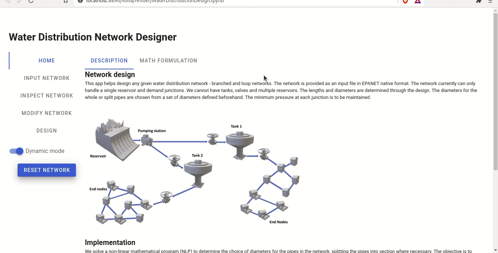

## Designer App

This Application requires an EPANET input file, containing branched or loop networks. Please ensure that there are only Junctions and Reservoir nodes and Pipe connections. The file must also contain information on the pipe lengths and the base-head at the reservoir.

For getting the optimal design, you must specify two extra information:

1. Minimum head required at each junction
    - to be specified in *meters* on the `NODES` sub-tab within `MODIFY NETWORK`

2. List of diameters to be considered for the network design
    - to be specified in *inches* on the `PIPES` sub-tab within `MODIFY NETWORK`

Then you can directly proceed to the `DESIGN` side-tab and move to the `SOLVE` sub-tab. Click on the `SOLVE` button to perform optimization with the default settings. You can view the results on the `VISUALIZE` page. There are two options:

1. `NETWORK`: View the interactive network graph with *pressure-head displayed at each node when hovered over*.

2. `PIPE DIMENSIONS`: Displays an interactive table of the final network design of the pipes. You can see the cost of each pipe and their proposed length distribtion across the diameters specified earlier.

### Tutorial

The below two animations demonstrate an optimal design of the [Hanoi network](https://emps.exeter.ac.uk/engineering/research/cws/resources/benchmarks/layout/hanoi.php) and [New York Tunnel](https://emps.exeter.ac.uk/engineering/research/cws/resources/benchmarks/expansion/new-york-water.php) water networks.

#### Hanoi Water Network (design example)

The allowed diameters and minimum required pressure head at junctions can be found in the problem description [here](https://emps.exeter.ac.uk/engineering/research/cws/resources/benchmarks/layout/hanoi.php).

#### New York Tunnel Water Network (expansion example)

The allowed diameters and minimum required pressure head at junctions can be found in the problem description [here](https://emps.exeter.ac.uk/engineering/research/cws/resources/benchmarks/expansion/new-york-water.php).

